# Tugas Praktikum 2 DPBO

## Program Data Film Bioskop

Program ini merupakan program pengelolaan data film bioskop yang dibuat menggunakan konsep **Object-Oriented Programming (OOP)**. Program dibuat dalam empat bahasa pemrograman, yaitu:

1. Python
2. C++
3. Java
4. PHP

Program menggunakan konsep **Multilevel Inheritance** dengan tiga class, yaitu `Media`, `Film`, dan `FilmBioskop`. Data film dikelola menggunakan kumpulan object `FilmBioskop`.

## 1. Janji

Saya Ingrid Gabryella Nainggolan dengan NIM 2506442 mengerjakan TP 2 dalam mata kuliah Desain dan Pemrograman Berorientasi Objek untuk keberkahan-Nya maka saya tidak melakukan kecurangan seperti yang telah dispesifikasikan. Aamiin.

## 2. Desain Program

Program menggunakan tiga class yang memiliki hubungan **Multilevel Inheritance**, yaitu:

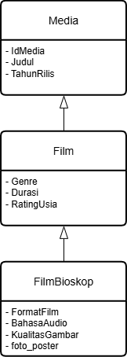

Hubungan inheritance pada program adalah:

```text
Media
  ↑
Film
  ↑
FilmBioskop
```

Class `Film` mewarisi class `Media`, sedangkan class `FilmBioskop` mewarisi class `Film`. Dengan demikian, `FilmBioskop` dapat menggunakan atribut dan method yang berasal dari `Film` dan `Media`.

### Class Media

Class `Media` merupakan class dasar yang menyimpan informasi umum mengenai suatu media.

Class `Media` memiliki atribut:

| Atribut | Tipe Data | Keterangan |
|---|---|---|
| `IdMedia` | String | ID atau identitas film |
| `Judul` | String | Judul film |
| `TahunRilis` | Integer | Tahun rilis film |

Method yang terdapat pada class `Media`:

| Method | Fungsi |
|---|---|
| `getIdMedia()` | Mengambil atau mengembalikan nilai `IdMedia` |
| `setIdMedia()` | Mengubah nilai `IdMedia` |
| `getJudul()` | Mengambil atau mengembalikan nilai `Judul` |
| `setJudul()` | Mengubah nilai `Judul` |
| `getTahunRilis()` | Mengambil atau mengembalikan nilai `TahunRilis` |
| `setTahunRilis()` | Mengubah nilai `TahunRilis` |

### Class Film

Class `Film` merupakan turunan dari class `Media` dan memiliki atribut tambahan yang berkaitan dengan film.

Class `Film` memiliki atribut:

| Atribut | Tipe Data | Keterangan |
|---|---|---|
| `Genre` | String | Genre film |
| `Durasi` | Integer | Durasi film dalam menit |
| `RatingUsia` | String | Rating atau batas usia penonton |

Method yang terdapat pada class `Film`:

| Method | Fungsi |
|---|---|
| `getGenre()` | Mengambil atau mengembalikan nilai `Genre` |
| `setGenre()` | Mengubah nilai `Genre` |
| `getDurasi()` | Mengambil atau mengembalikan nilai `Durasi` |
| `setDurasi()` | Mengubah nilai `Durasi` |
| `getRatingUsia()` | Mengambil atau mengembalikan nilai `RatingUsia` |
| `setRatingUsia()` | Mengubah nilai `RatingUsia` |

Selain itu, class `Film` juga mewarisi atribut dan method dari class `Media`.

### Class FilmBioskop

Class `FilmBioskop` merupakan turunan dari class `Film` dan menjadi class terakhir dalam pewarisan.

Class `FilmBioskop` memiliki atribut:

| Atribut | Tipe Data | Keterangan |
|---|---|---|
| `FormatFilm` | String | Format penayangan film |
| `BahasaAudio` | String | Bahasa audio film |
| `KualitasGambar` | String | Kualitas gambar film |
| `foto_poster` (PHP) | String | Path file poster film |

Method yang terdapat pada class `FilmBioskop`:

| Method | Fungsi |
|---|---|
| `getFormatFilm()` | Mengambil atau mengembalikan nilai `FormatFilm` |
| `setFormatFilm()` | Mengubah nilai `FormatFilm` |
| `getBahasaAudio()` | Mengambil atau mengembalikan nilai `BahasaAudio` |
| `setBahasaAudio()` | Mengubah nilai `BahasaAudio` |
| `getKualitasGambar()` | Mengambil atau mengembalikan nilai `KualitasGambar` |
| `setKualitasGambar()` | Mengubah nilai `KualitasGambar` |
| `getFotoPoster()` | Mengambil atau mengembalikan path `foto_poster` pada PHP |
| `setFotoPoster()` | Mengubah path `foto_poster` pada PHP |

Dengan demikian, object `FilmBioskop` memiliki seluruh atribut dan method yang berasal dari class `Media`, `Film`, dan `FilmBioskop`.

## 3. Konsep OOP yang Digunakan

### Class

Class `Media`, `Film`, dan `FilmBioskop` digunakan sebagai blueprint untuk membuat object film bioskop.

### Object

Setiap data film dibuat sebagai object dari class `FilmBioskop`. Object tersebut menyimpan seluruh informasi mengenai satu film.

### Encapsulation

Atribut pada setiap class dibuat private sehingga tidak dapat diakses secara langsung dari luar class. Pengaksesan dan perubahan data dilakukan melalui getter dan setter.

### Constructor

Constructor digunakan untuk memberikan nilai awal ketika object `FilmBioskop` dibuat. Constructor pada `FilmBioskop` juga memanggil constructor dari parent class.

### Method

Method merupakan fungsi yang terdapat di dalam class dan digunakan untuk melakukan suatu operasi terhadap object.

Pada program ini terdapat dua jenis method utama, yaitu getter dan setter.

**Getter** digunakan untuk mengambil atau mendapatkan nilai dari atribut yang bersifat private.

Contohnya:

```text
getJudul()
getGenre()
getDurasi()
```

**Setter** digunakan untuk mengubah atau memberikan nilai baru pada atribut yang bersifat private.

Contohnya:

```text
setJudul()
setGenre()
setDurasi()
```

Penggunaan getter dan setter mendukung konsep encapsulation karena atribut tidak diakses secara langsung dari luar class.

### Multilevel Inheritance

Program menggunakan konsep **Multilevel Inheritance**, yaitu pewarisan class secara bertingkat.

```text
Media
  ↑
Film
  ↑
FilmBioskop
```

Class `Film` mewarisi class `Media`, kemudian class `FilmBioskop` mewarisi class `Film`.

Dengan demikian, class `FilmBioskop` dapat menggunakan atribut dan method yang berasal dari class `Film` dan `Media`.

### Array/List of Object

Program mengelola sekumpulan object `FilmBioskop` dalam array atau list. Setiap object menyimpan informasi mengenai satu film.

## 4. Fitur Program

### Tambah Data

Fitur tambah digunakan untuk memasukkan data film baru ke dalam program. Pengguna mengisi informasi film sesuai dengan atribut yang tersedia. Setelah data diisi, program membuat object `FilmBioskop` baru dan menyimpannya ke dalam kumpulan data film.

Data yang dimasukkan meliputi:

- ID Media
- Judul
- Tahun Rilis
- Genre
- Durasi
- Rating Usia
- Format Film
- Bahasa Audio
- Kualitas Gambar
- Foto Poster

### Pengecekan ID yang Sama

Program melakukan pengecekan terhadap ID yang dimasukkan oleh pengguna.

Jika ID yang dimasukkan sudah digunakan oleh film lain, program akan memberikan pesan bahwa ID tersebut sudah ada dan pengguna harus memasukkan ID yang berbeda.

### Pengecekan Data yang Kurang atau Lebih

Program melakukan pengecekan terhadap data yang dimasukkan.

Jika terdapat data yang kurang atau jumlah data yang dimasukkan lebih dari yang dibutuhkan, program akan memberikan pesan kesalahan sehingga data dapat diperbaiki sebelum disimpan.

### Tampilkan Data

Fitur tampil digunakan untuk melihat seluruh data film yang telah tersimpan.

Pada implementasi terminal, data ditampilkan melalui menu program. Pada implementasi PHP, data ditampilkan dalam bentuk tabel melalui halaman website.

### Keluar Program

Fitur keluar digunakan untuk mengakhiri program setelah pengguna selesai mengelola data film.

## 5. Implementasi pada 4 Bahasa

### Python

Program Python menggunakan list untuk menyimpan kumpulan object `FilmBioskop`. Program dijalankan melalui terminal dan menyediakan menu untuk menambahkan serta menampilkan data film.

### C++

Program C++ menggunakan array of object untuk menyimpan data film. Program dijalankan melalui terminal dengan menu untuk melakukan operasi terhadap data film.

### Java

Program Java menggunakan array object untuk menyimpan kumpulan data film. Program dijalankan melalui terminal dengan class `FilmBioskop` sebagai object utama.

### PHP

Program PHP menggunakan array yang berisi object `FilmBioskop`. Program dibuat dalam bentuk website sehingga proses pengelolaan data dilakukan melalui browser.

Pada PHP, gambar poster film disimpan secara lokal di dalam folder `images` dan path gambar digunakan sebagai atribut `foto_poster`.

## 6. Alur Program

Alur program dimulai dengan menjalankan program dan menampilkan menu kepada pengguna. Pengguna dapat memilih untuk menambahkan data, menampilkan data, atau keluar dari program.

```text
Mulai
  ↓
Menampilkan Menu
  ↓
Memilih Menu
  │
  ├── Tambah Data
  │      ↓
  │   Input Data Film
  │      ↓
  │   Pengecekan ID
  │      ↓
  │   ID Sudah Ada?
  │      │
  │      ├── Ya → Tampilkan Pesan Error
  │      │
  │      └── Tidak
  │             ↓
  │      Pengecekan Data
  │             ↓
  │      Data Kurang/Lebih?
  │             │
  │             ├── Ya → Tampilkan Pesan Error
  │             │
  │             └── Tidak
  │                    ↓
  │              Membuat Object FilmBioskop
  │                    ↓
  │              Menyimpan Data
  │
  ├── Tampilkan Data
  │      ↓
  │   Menampilkan Seluruh Data Film
  │
  └── Keluar
         ↓
       Selesai
```

### Penjelasan Alur

1. Program dijalankan dan menampilkan menu utama.
2. Pengguna memilih menu yang tersedia.
3. Jika memilih menu tambah data, pengguna memasukkan seluruh data film.
4. Program melakukan pengecekan terhadap ID yang dimasukkan.
5. Jika ID sudah digunakan, program menampilkan pesan bahwa ID sudah ada.
6. Jika ID belum digunakan, program melakukan pengecekan jumlah data yang dimasukkan.
7. Jika data kurang atau lebih, program menampilkan pesan kesalahan.
8. Jika seluruh data sudah sesuai, program membuat object `FilmBioskop`.
9. Object yang telah dibuat dimasukkan ke dalam kumpulan data film.
10. Pengguna dapat memilih menu tampil data untuk melihat seluruh data film.
11. Jika pengguna memilih menu keluar, program selesai.

## 7. Data Film

Data awal yang digunakan dalam program:

| ID | Judul | Tahun Rilis | Genre | Durasi | Rating | Format | Audio | Kualitas |
|---|---|---:|---|---:|---|---|---|---|
| FB001 | The Conjuring 2 | 2016 | Horror | 134 menit | 17+ | 2D | Inggris | 4K Digital |
| FB002 | Project Hail Mary | 2026 | Sci-Fi | 156 menit | 13+ | IMAX 2D | Inggris | 4K Laser |
| FB003 | The Greatest Showman | 2017 | Drama/Musical | 105 menit | SU | 2D | Inggris | 4K Digital |
| FB004 | Portrait of a Lady on Fire | 2019 | Drama/Romance | 122 menit | 17+ | 2D | Prancis | 2K Digital |
| FB005 | Lady Bird | 2017 | Comedy/Drama | 94 menit | 17+ | 2D | Inggris | 2K Digital |

## 8. Struktur File

```text
TP2DPBO2526C2/

│
├── Python/
│   ├── Media.py
│   ├── Film.py
│   ├── FilmBioskop.py
│   ├── Main.py
│   └── file.txt
│
├── C++/
│   ├── Media.cpp
│   ├── Film.cpp
│   ├── FilmBioskop.cpp
│   ├── Main.cpp
│   └── file.txt
│
├── Java/
│   ├── Media.java
│   ├── Film.java
│   ├── FilmBioskop.java
│   ├── Main.java
│   └── file.txt
│
├── PHP/
│   ├── Media.php
│   ├── Film.php
│   ├── FilmBioskop.php
│   ├── index.php
│   ├── show.php
│   ├── style.css
│   ├── file.txt
│   └── images/
│
├── Dokumentasi/
│   ├── CPP/
│   ├── Java/
│   ├── PHP/
│   ├── Python/
│   └── Diagram_TP2.drawio.png
│
└── README.md
```

## 9. Dokumentasi Program

### Python

- Tampilan data awal.

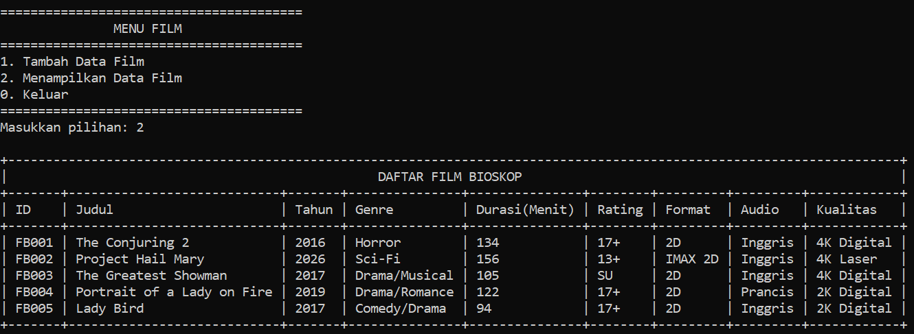

- Proses tambah data.

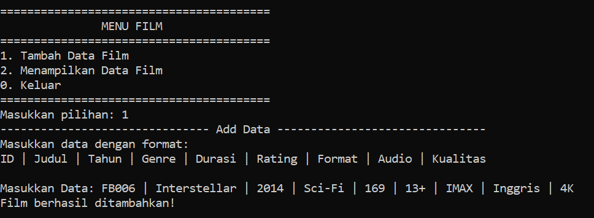

- Tampilan data setelah ditambahkan.

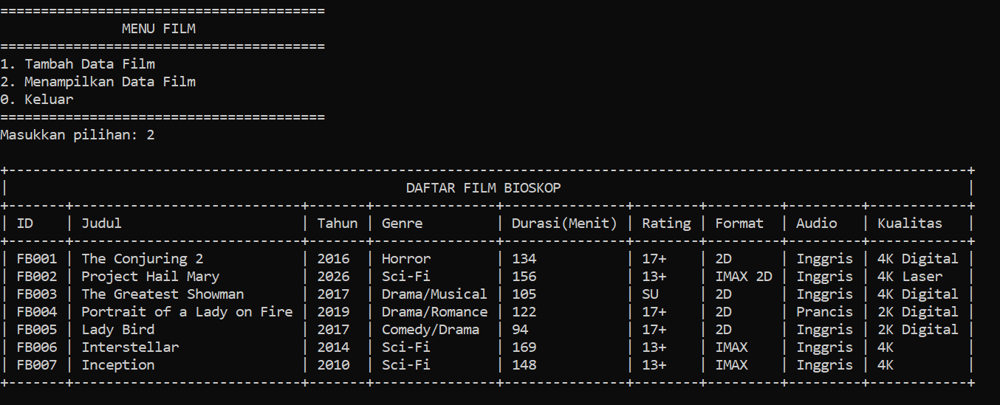

- Pengecekan ID yang sama.

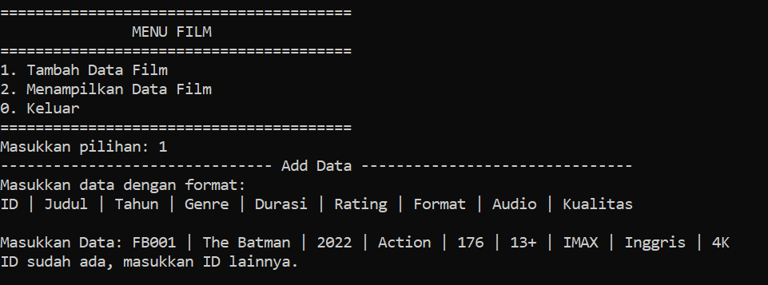

- Pengecekan data yang kurang atau lebih.


- Proses keluar dari menu.

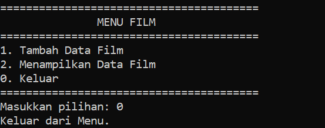

### C++

- Tampilan data awal.

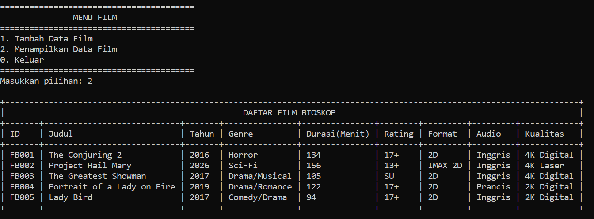

- Proses tambah data.


- Tampilan data setelah ditambahkan.

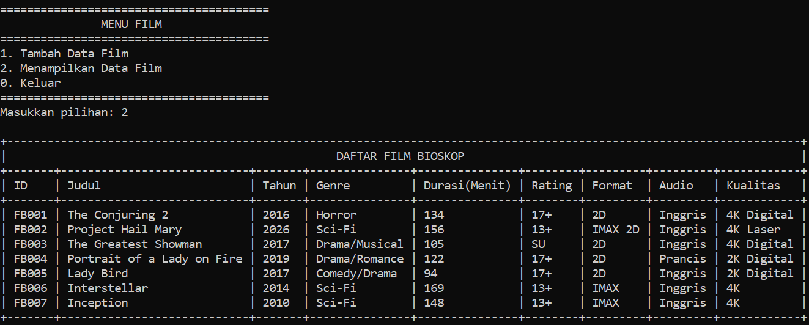

- Pengecekan ID yang sama.

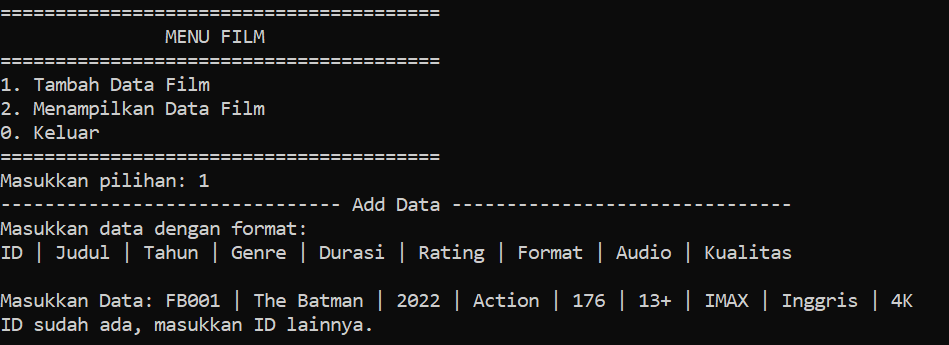

- Pengecekan data yang kurang atau lebih.

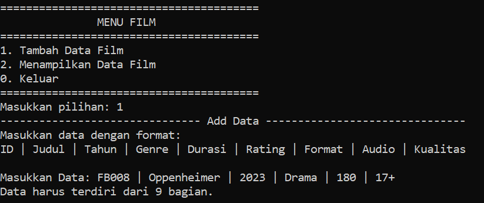

- Proses keluar dari menu.

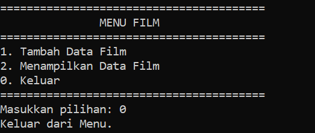

### Java

- Tampilan data awal.

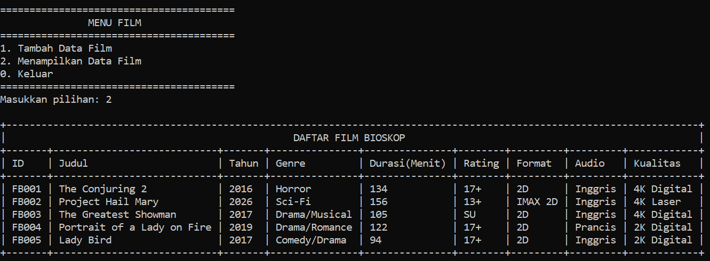

- Proses tambah data.


- Tampilan data setelah ditambahkan.

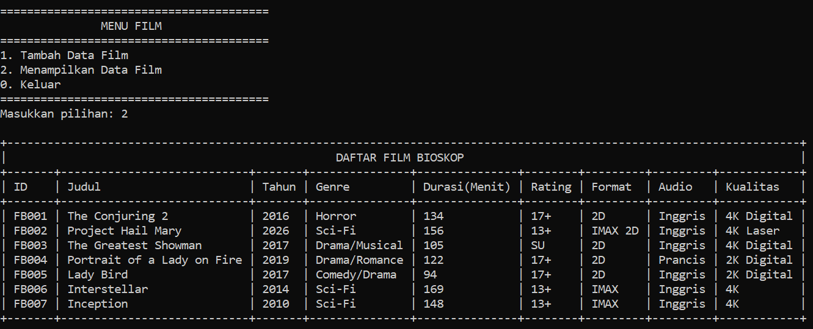

- Pengecekan ID yang sama.

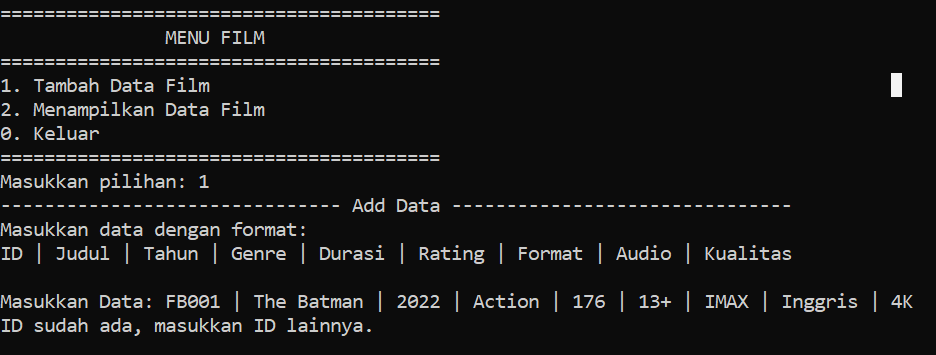

- Pengecekan data yang kurang atau lebih.

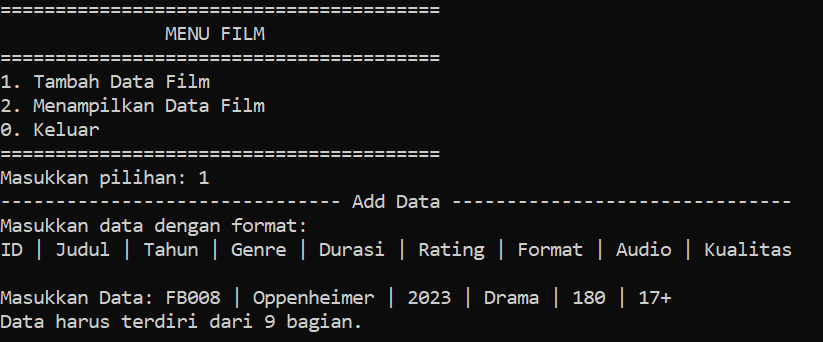

- Proses keluar dari menu.

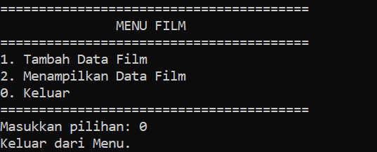

### PHP

- Tampilan data awal.

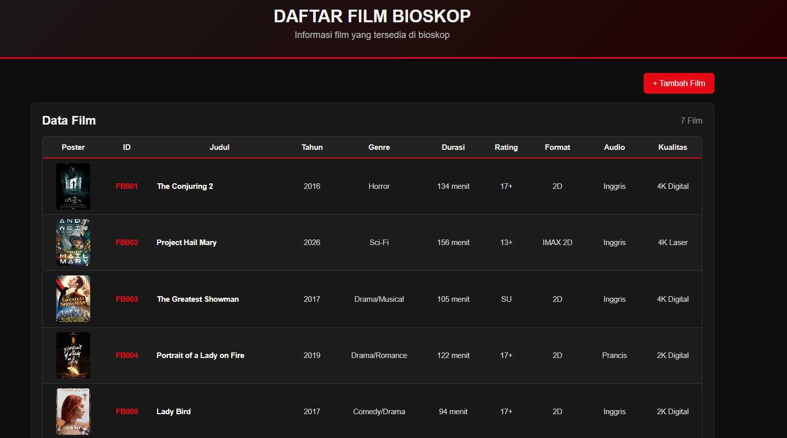

- Proses tambah data.

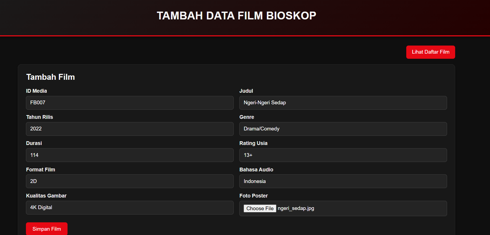

- Tampilan data setelah ditambahkan.

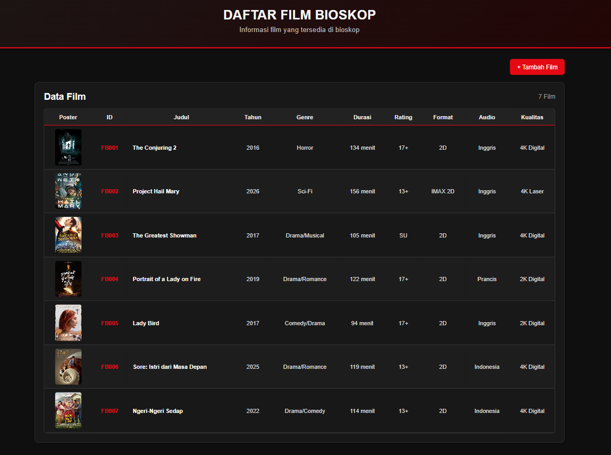

- Pengecekan ID yang sama.

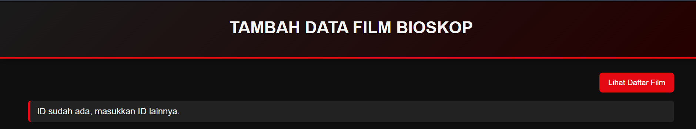

- Pengecekan data yang kurang atau lebih.

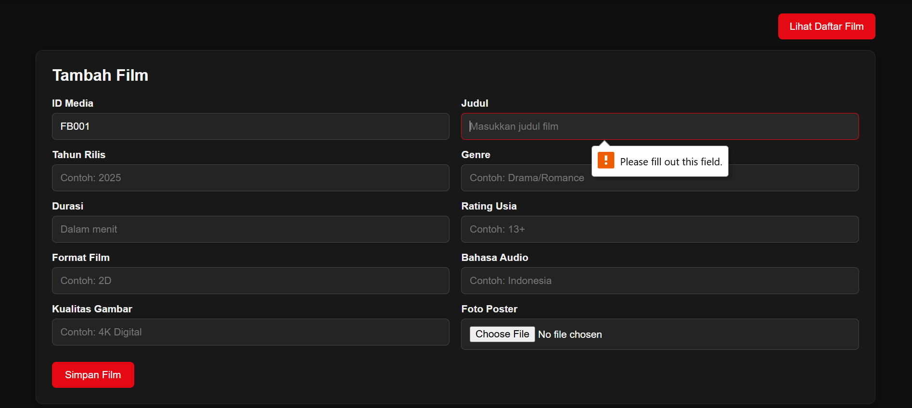

